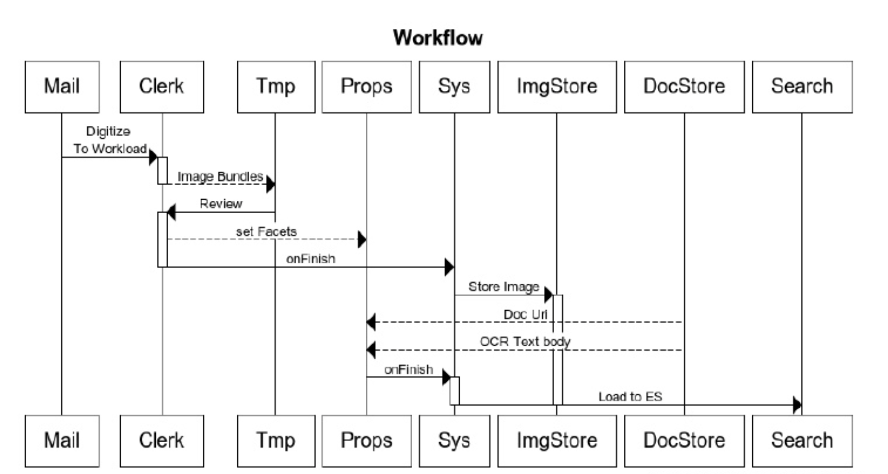
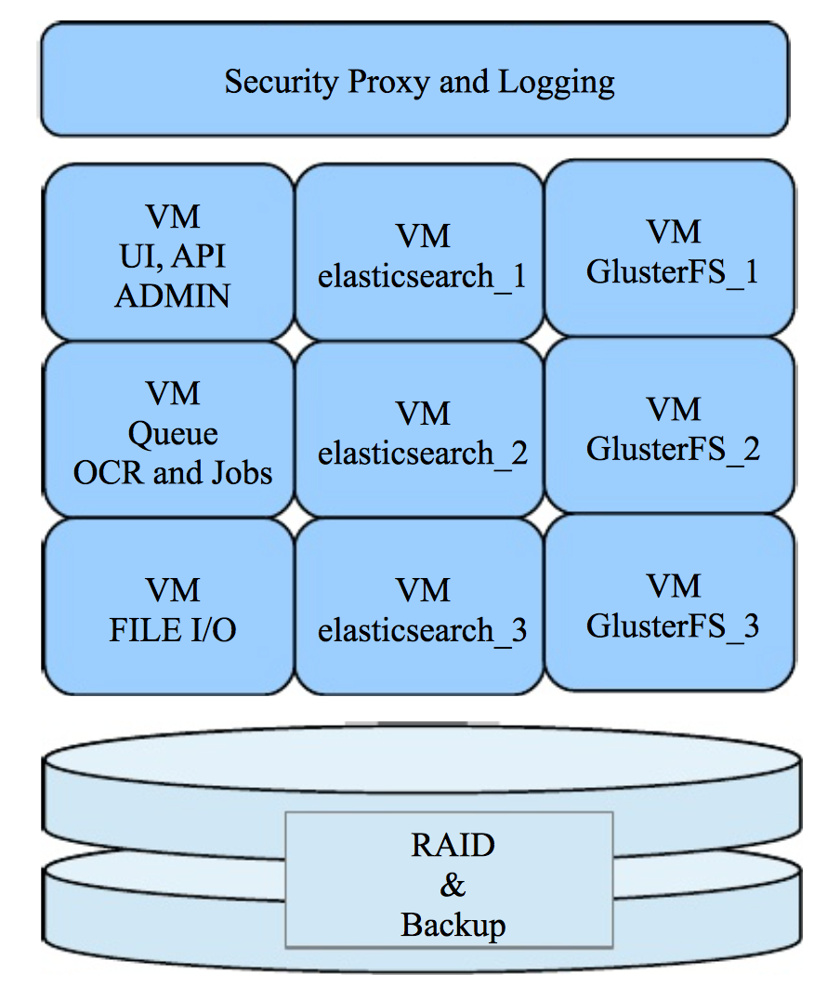

<h1 align="center"> Room B Gone</h1>
<h6 align="center">MRD V1.0</h6>
<h6 align="center">Authors: Super Awesome Nice Tiger Team 2</h6>
***
##Table of Contents
+ [Preface](#preface)
+ [Problems](#problems)
+ [Opportunity Size](#opportunity-size)
+ [Current Solutions](#current-solutions)
+ [Proposed Solution](#proposed-solution)
+ [Theory of Operations](#theory-of-operations)
+ [Use Cases](#use-cases)
+ [Business Model](#business-model)

***

##Preface
Our medical office is required to store multitudes of patient files. The files consist of various medical notes, correspondences and financial statements. The documents are stored in folders, and are tabbed by patient name. Patient names may collide, therefore a combination of the patient's name and the last 4 digits of his or her SSN number are used. 
Archiving new correspondences is a semi-weekly process of sorting and filing new documents into their corresponding folders. Files are used by checking them out from a ledger.
Old documents are not removed when new files are created, growing indefinitely.

##Problems
1. Files are stored on premises in 400 square feet. At a cost of $30 per square feet per year, this amounts to $12,000.
2. Files are NOT backed up for off-site storage, which would be an additional expense.
3. Because of the lack of backup, files are at constant risk of loss.
4. Files are stored without encryption, access control or access logs.
5. Sending files requires faxing or copying, even for inter-clinic requests.
6. While files are removed from the file room, their updates are blocked.
7. Paper-based data can not be analysed or searched automatically.
8. Other departments, namely Finance and HR also produce similar files. (And have similar problems.)

##Opportunity Size
According to the American Academy Of Family Physicians, a typical physician sees on average 80 patients per week. Extrapolating from this number we estimate average practice documentation needs are in the range of 1000 files per year. There are over 200,000 physicians practicing in the USA. Half of these on average are on a single provider organization, and the rest on two. [References](#refs)

This makes the estimated market 200,000 practices * 1.5 physicians * 1,000 files per physician = 300 million files a year.  This is not considering specialists, workman compensations, and medicare / medicaid practices that are required by law to keep patient files pretty much indefinitely.
The estimatied USA population is just over 300 million according to the latest census.

##Current Solutions
There is not a single solution to the tried and true file room, were you can place papers into folders. Current solutions are Electronic Health Records, the cloud, and document data stores.

EHR systems are nothing but relational data stores, some with the ability to store binary files. EHR records can be manipulated and edited, therefore still requiring paper originals to backup in subpoenas. Cloud based systems make storage cheap, yet HIPAA regulations require data to be encrypted and encrypted indexes prevent any full text search functionality. At the same time, the cost of storage and search technology is going down so much that it makes sense to bring storage from the cloud back to the “file room” appliance.

##Proposed Solution
A generic virtual file room hardware/software appliance. 
####Document Lingo
We tried to map everything to a paper based file room.

+ **Index** – a specific container, for example Medical Records or Finance Department. Same installations can have multiple indices, so that documents from different indices cannot be cross-searched.
+ **Tab** – is a unique identifier, named after a tab on a file folder. It is a primary key in RBDMS lingo. A tab is defined when a system is set up, for example we will use Last Name + First Name + Last 4 digits of SSN as a unique Tab.
+ **Folder** – a folder is a collection of documents under given Tab
+ **Facet** – A defined dimension in taxonomy, for example Gender:Male, DocumentType:Invoice. Facets need to be defined, but facet values may be defined later or as you go. However facet values must be defined to be used and to be available in drop downs. Hence each new facet value is automatically added to the facet, if such permissions are set.
+ **Taxonomy** – a collection of facets.
+ **Elasticsearch** – an open-source text search engine.

####Features
+ The ability to scan paper documents or import, describe indices, perform Optical Character Recognition, perform a full text search, and to store documents indefinitely.
+ The ability to full text or facet search to retrieve documents one by one or as a folder to multiple devices.
+ The ability to integrate to other systems and the ability to back up to off-site.

##Theory of Operations
1. The taxonomy is configured to outline required tab indices and optional facet taxonomies.
2. Documents arrive via mail to a clerk.
 1. Documents can be for new patient or for existing patient's file.
3.The clerk scans images into PDF documents, one document per Envelope using a Xi500 Scanner.
4. The clerk catalogues the image.
 1. For a new patient: create a new folder, so that a new tab index shall be created
 2. For an old patient: add to existing tab and use its settings
5. Add taxonomy information if needed. This is the end of human interactions
6. Background systems process the image with OCR and store the extracted text along with facet data in an Elasticsearch engine
7. Documents are ready for search and folders are ready for download and use.

###Appliance
####Overview
The proposed appliance is a “private cloud” architecture, where multiple VMs run on single physical machine. The physical machine is a multicore PC with a RAID 0 setup, running Ubuntu 12.04 LTS. The software runs in several VMs inside the appliance in order to separate application layers and provide upgrade or expansion paths.
####Architecture

##Use Cases
####Overview
Documents are stored under  tabs and described via taxonomy. Both tabs and taxonomy are user defined. For instance, the concept of a tab may be the first name, last name, and DOB of patient. A taxonomy could be location, diagnosis, day of service, insurance company, etc., as long as the main EHR system is not duplicated. Furthermore all documents will undergo OCR and full text indexing via Elasticsearch. The full text search together with tabs, taxonomy, and faceting will create multiple search dimensions across the entire file room. The process of creating and maintaining the virtual file room will be mapped after maintaining a real file room and will be very simple and flexible. The entire system will be on premises. It will provide security encryption and assess logs yet be accessible remotely via tunnel bridge or VPN, or may even be moved to the cloud when the technology will be secure enough. Backups shall be automated and available for off-site deposit. The entire system will provide flexible and adaptable APIs to integrate with 3rd party systems. The check in and checkout process will be on tablets, where the user can see and search the entire file room, to find exactly what is needed.

##Business Model
We will supply a complete hardware/software appliance solution and service combination either via independent integrators or directly.  The appliance will be leased to the customer through a finance company. Services will be provided and priced with their appropriate tiers.

***
#### References
http://www.aafp.org/about/the-aafp/family-medicine-facts/table-6.html
http://en.wikipedia.org/wiki/Group_medical_practice_in_the_United_States